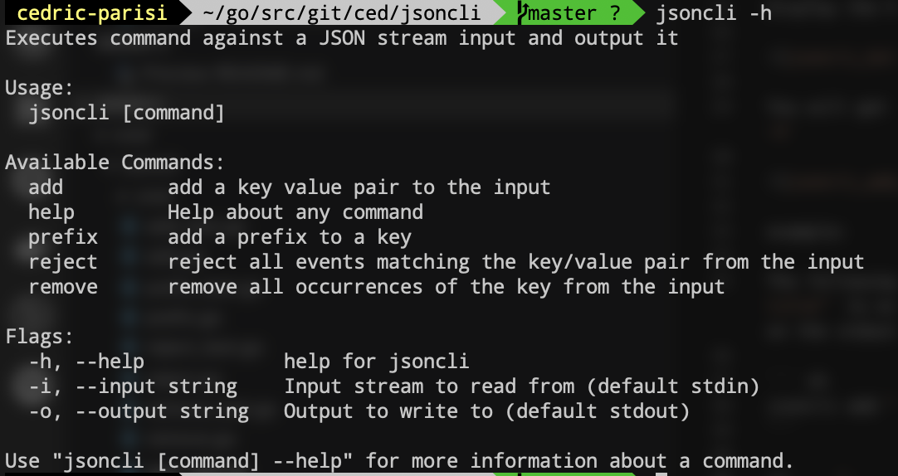
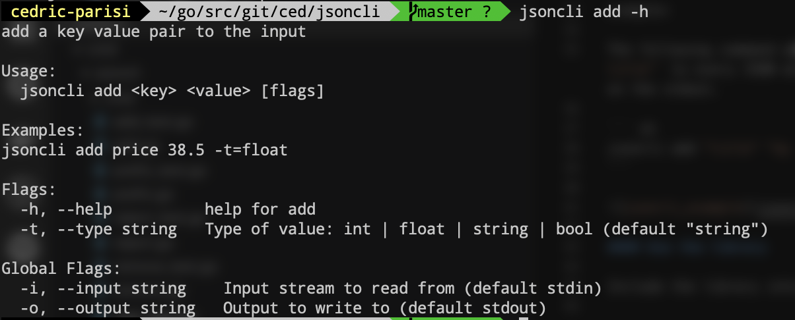
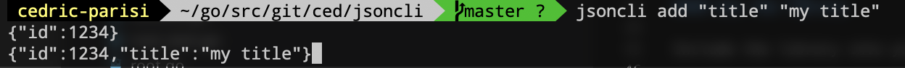

# jsoncli

jsoncli is an open source cli/library to update large stream of JSON objects.

## Getting started

Before you start, make sure `golang` is installed.

### Installation

Use `go get` to download and install the latest version of jsoncli:

```
go get github.com/cedric-parisi/jsoncli/...
```

That way you can use `jsoncli` directly

### Usage

These instructions will help you to use the jsoncli cli or library.

#### Use the cli

Display the help, using `jsoncli -h`:



You will get command dedicated help by typing: `jsoncli [COMMAND] -h`



example:

The following command will add the key/value pair `"title":"my title"` to every JSON objects from the stdin and display the result on the stdout.

``` sh
jsoncli add "title" "my title"
```



#### Use the library

Include the library into your application

``` go
import github.com/cedric-parisi/jsoncli/pkg/json
```

First you need to create a processor:

``` go
json.NewProcessor(limit int64) Processor // limit being the max n bytes you want to read, 0 for unlimited reading
```

Then, you can call the process method:

```go
func (p *processor) Process (input io.Reader, output io.Writer, options ...Option) error
```

All baked-in options are:

```go
Add(key string, value interface{}) // Add a key/value pair to every JSON objects
Prefix(key, prefix string) // Add a prefix to the key to every JSON objects
Remove(key string) // Remove the key and its value for every JSON objects
Reject(key string, value interface{}) // Reject every JSON objects matching the key/value pair
```

The following example will prefix `id` with `legacy` to the JSON object from the stdin and output the result to the stdout.

```go
p := json.NewProcessor(0)
err := p.Process(os.Stdin, os.Stdout, json.Prefix("id", "legacy")))
```

You can easily implement your own option by following the pattern below:

```go
func MyOption(key string, value string) jsoncli.Option {
    return func(e *jsoncli.Event) {
        // Your option code here
    }
}
```

And you can pass your option to the `Process` function as normal `Option`

```go
err := p.Process(input, output, MyOption("key", "value"))
```

### Local development

Once the project downloaded, launch the following command to install all dependencies:

```
make install
```

#### Build

To build the `jsoncli` use:

```
make build
```

#### Run

``` 
./jsoncli [COMMAND] [ARGS] [FLAGS]
```

or directly using `go run`

```sh
go run cmd/jsoncli/main.go [COMMAND] [ARGS] [FLAGS]
```

#### Tests

Launching the following command will run all unit tests:

```
make test
```

Launching the following command will open a new tab to your browser with the test coverage:

```
make coverage
```